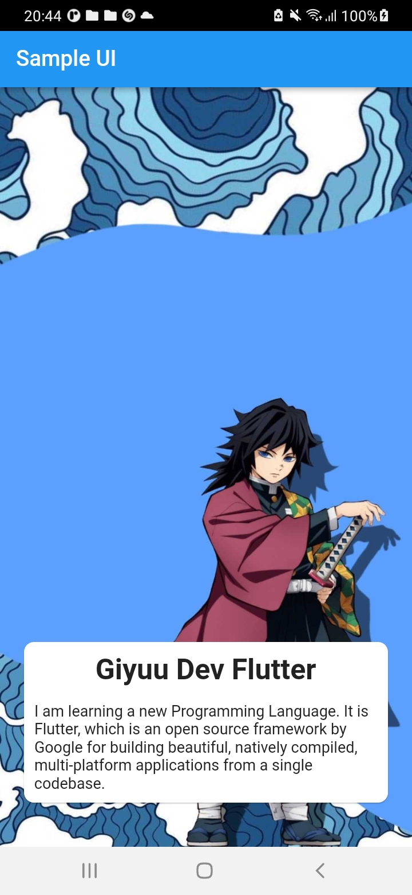

# lesson19_design_sample_ui

# Insert image
- In this topic, I insert an image from the internet the URL
# Code Example:
Expanded(
        // color: Colors.lightGreen,
        // insert an image from the internet through URL
        child: Image.network(
          'https://i.pinimg.com/originals/c8/33/35/c83335c6cc5eae6b676e9d0095089bf7.jpg',
          alignment: Alignment.center,
          //stretch image
          height: double.infinity,
          width: double.infinity,
          fit: BoxFit.fill,
        ),
      ),
- Stretch image by height and width:
height: double.infinity,
width: double.infinity,
