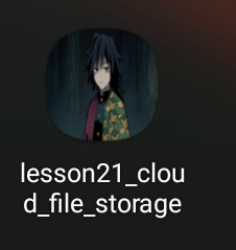
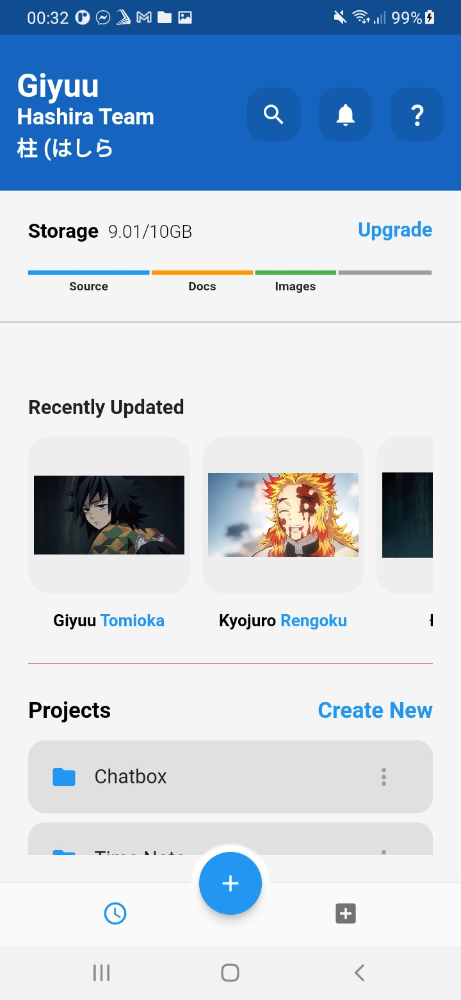
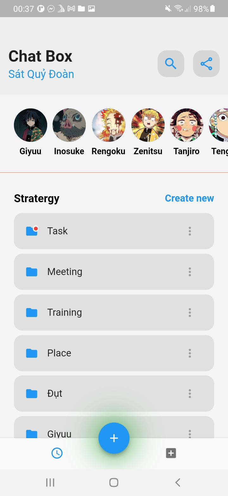

# lesson21_cloud_file_storage

A new Flutter project.

## Getting Started

This project is a starting point for a Flutter application.

A few resources to get you started if this is your first Flutter project:

- [Lab: Write your first Flutter app](https://docs.flutter.dev/get-started/codelab)
- [Cookbook: Useful Flutter samples](https://docs.flutter.dev/cookbook)

For help getting started with Flutter development, view the
[online documentation](https://docs.flutter.dev/), which offers tutorials,
samples, guidance on mobile development, and a full API reference.
# Change the icon for App
- You can access this link to generate different app icon sizes for all platforms: https://www.appicon.co/
```
- First add to dependencies:
dev_dependencies:
  flutter_test: 
    sdk: flutter

  flutter_lints: ^2.0.0 
  flutter_launcher_icons: "^0.13.1" # add this line to dependencies

- Second add these lines:
flutter_icons:
  image_path: "assets/images/ic_giyuu.png"  # path of image
  android: true
  ios: true

- Run this script to change the default icon of App
    flutter pub get
    flutter pub run flutter_launcher_icons:main
```
- Result: 
    "✓ Successfully generated launcher icons" <br>
    
    

# UI of this App
- Main UI when you open this app <br>
  

- Click into ChatBox or some folders below will move you to another activity <br>
  
