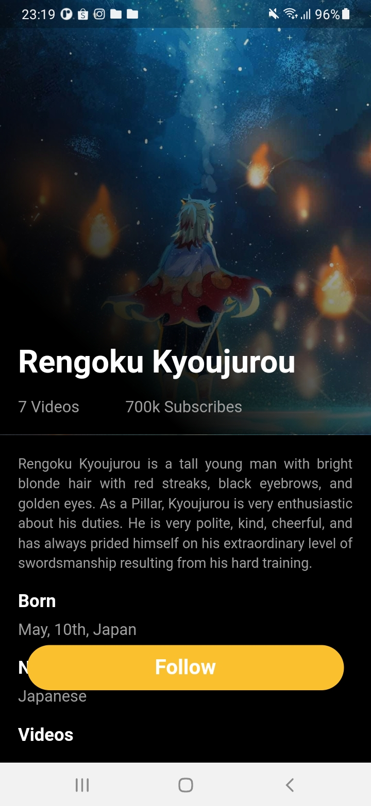
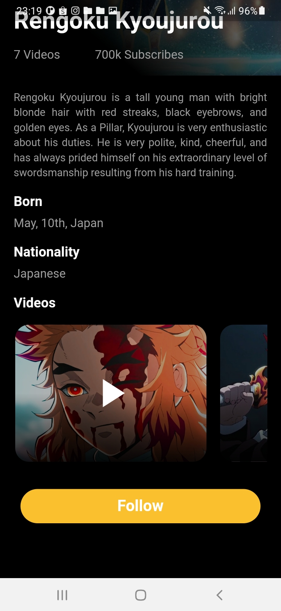
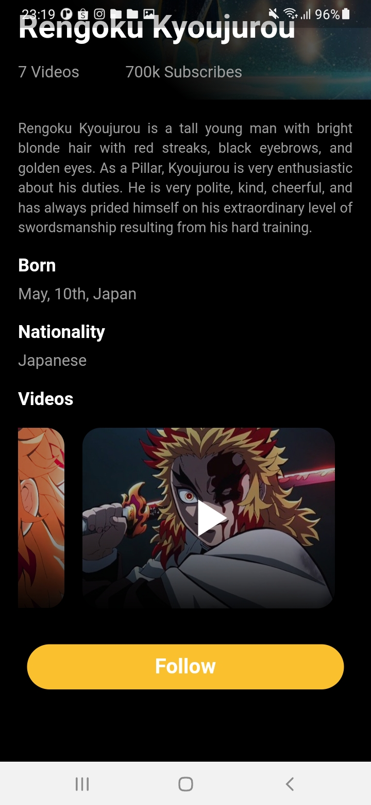

# lesson31_flim_profile
Design Film Profile - Characters designed by me I was inspired by the Kimetsu no Yaiba - movie Mugen Train

[](assets/screenshot/img_introduce.jpg)
[](assets/screenshot/img_video_1.jpg)
[](assets/screenshot/img_video_2.jpg)
<br>

## Note Source Code
- 'Align' here will be at half of its parents width
  ```
  Widget makeVideo({image}) {
    return AspectRatio(
      // widget's width will be 1.5 times its height
      aspectRatio: 1.5 / 1,
      child: Container(
        //...
        ),
        child: Container(
          //...
          ),
          child: const Align(
            child: Icon(
              Icons.play_arrow,
              color: Colors.white,
              size: 70,
            ),
          ),
        ),
      ),
    );
  }
  
  ```

- For me: To justify the TEXT

```
 Text(
    'Something at here...'
    style: TextStyle(
      color: Colors.grey,
      height: 1.4,
    ),
    // căn đều 2 bên
    textAlign: TextAlign.justify,  // remember this line
  ),
```
