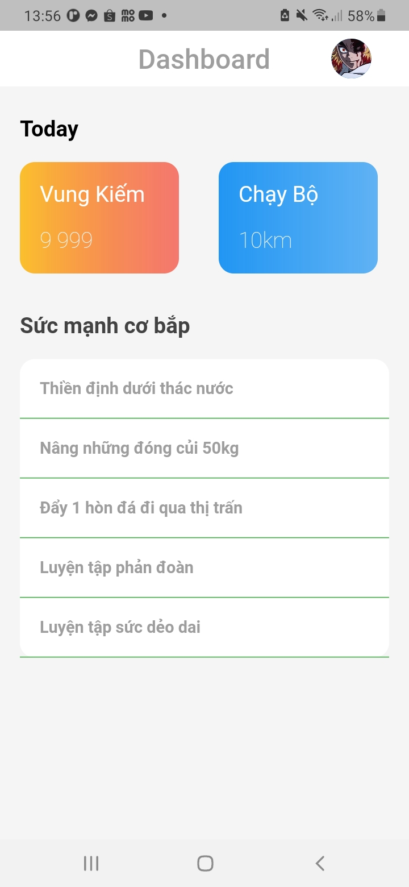
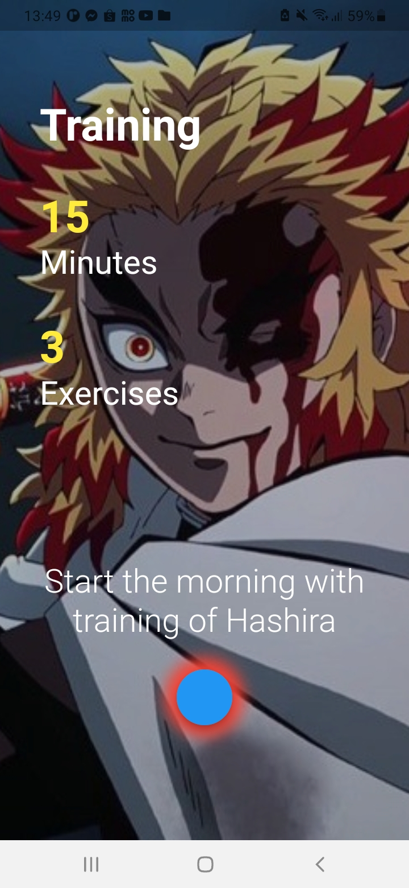
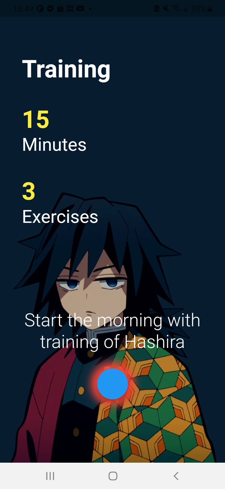
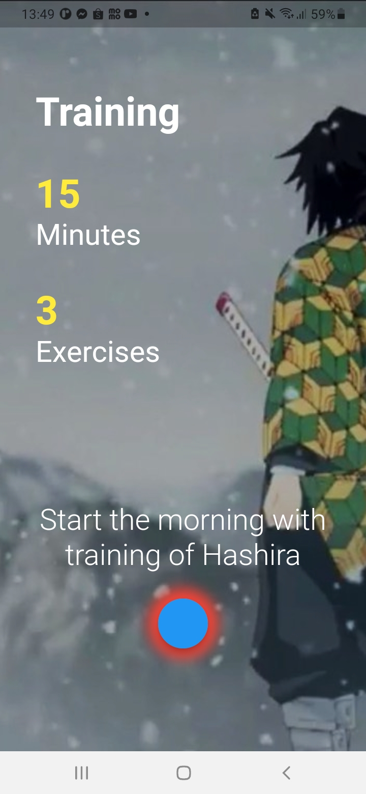
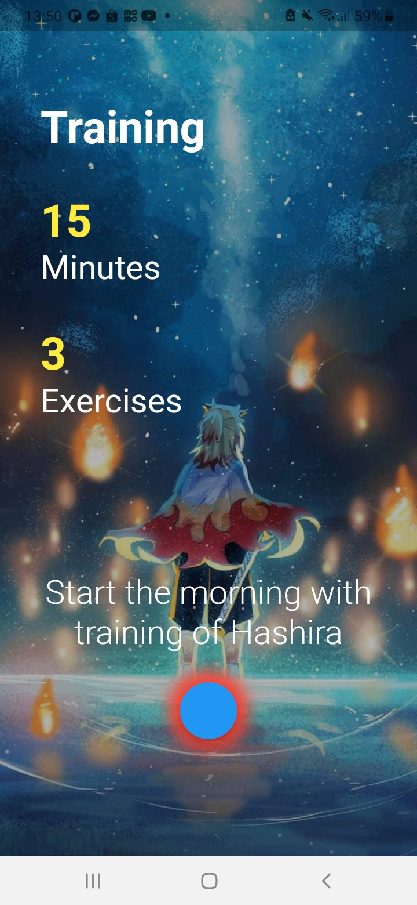

# lesson33_page_transition
Design Transition Page

## GUI 
[](assets/screenshot/img_main_traning.jpg)
[](assets/screenshot/img_swipe_1.jpg)
[](assets/screenshot/img_swipe_2.jpg)
[](assets/screenshot/img_swipe_3.jpg)
[](assets/screenshot/img_swipe_4.jpg)

### Note Source Code
- Manage the scrolling behavior of the PageView
  
```
  //initial page to be displayed
  //sets the fraction of the viewport occupied by each page.
  late final PageController _pageController =
      PageController(initialPage: 0, viewportFraction: 1.0);

  //the current image being displayed.
  late String _currentImage = 'img_rengoku_with_bong_ro.jpeg';

  @override
  void initState() {
    super.initState();
    //sets up a timer that fires every 5 seconds
    //and scrolls to the next page in the PageView
    Timer.periodic(const Duration(seconds: 5), (timer) {
      //creates a periodic timer that fires every 5 seconds

      //gets the current page number
      // + 1 --> the index of the next page.
      //
      final nextPage = (_pageController.page!.toInt() + 1) % 4;
      _pageController.animateToPage(
        nextPage,
        duration: const Duration(milliseconds: 500),
        curve: Curves.easeInBack,
      );
    });
  }

  @override
  void dispose() {
    _pageController.dispose();
    super.dispose ();
  }
```
