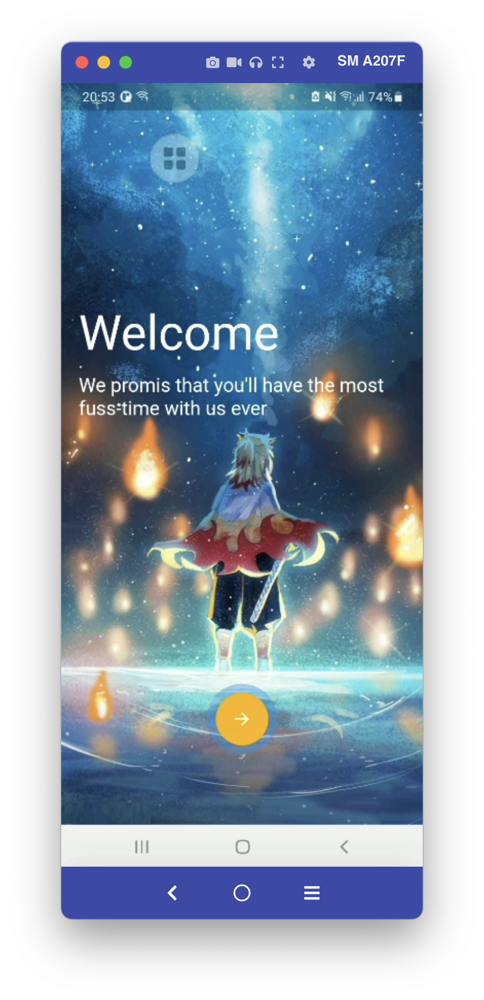
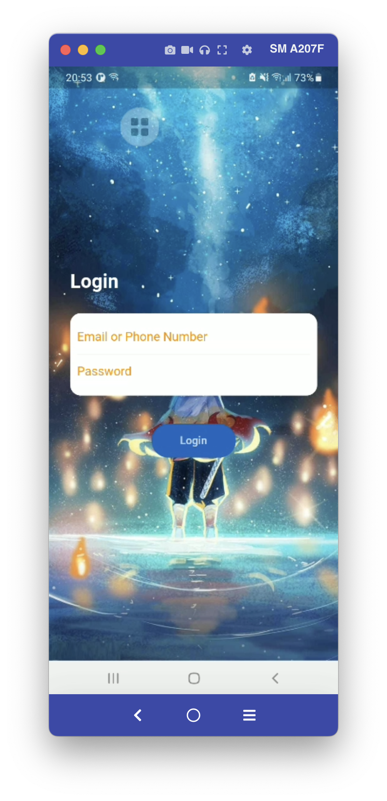

# lesson35_splash_screen_login
Desgin Splash Screen and Animation for Login 

### Note for dependencies:
- Version of simple_animation page_transition when we add them to dependencies

    ```
        simple_animations: ^3.0.0
        page_transition: ^2.0.0
    ```

### Source code for animation
- This source is for FadeAnimation
    ```
    import 'package:flutter/material.dart';
    import 'package:simple_animations/simple_animations.dart';

    // Create your Animation Example
    enum AniProps { opacity, translateY }

    class FadeAnimation extends StatelessWidget {
    final double delay;
    final Widget child;

    FadeAnimation(this.delay, this.child);

    @override
    Widget build(BuildContext context) {
        final tween = MultiTween<AniProps>()
        ..add(AniProps.opacity, Tween(begin: 0.0, end: 1.0))
        ..add(AniProps.translateY, Tween(begin: -30.0, end: 0.0),
            Duration(milliseconds: 500), Curves.easeOut);

        return PlayAnimation<MultiTweenValues<AniProps>>(
        delay: Duration(milliseconds: (500 * delay).round()),
        duration: tween.duration,
        tween: tween,
        child: child,
        builder: (context, child, animation) => Opacity(
            opacity: animation.get(AniProps.opacity),
            child: Transform.translate(
                offset: Offset(0, animation.get(AniProps.translateY)),
                child: child),
        ),
        );
    }
    }

    ```
### Some GUI

[](assets/screenshot/img_gui.png)
[](assets/screenshot/img_start_animation.png)
[](assets/screenshot/img_login.png)