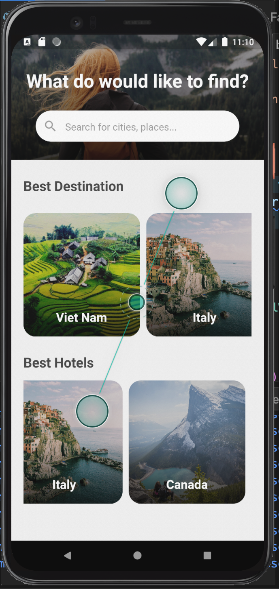

# lesson39_travel_app
GUI Design Travel App


### Screenshot
[](assets/screenshot/img_travel_app.png)


### Note Source Code
- Add Animation package to dependencies:
```
  simple_animations: ^3.0.0

```

- Source for Fade Animation:
```
import 'package:flutter/material.dart';
import 'package:simple_animations/simple_animations.dart';

// Create your Animation Example
enum AniProps { opacity, translateY }

class FadeAnimation extends StatelessWidget {
  final double delay;
  final Widget child;

  FadeAnimation(this.delay, this.child);

  @override
  Widget build(BuildContext context) {
    final tween = MultiTween<AniProps>()
      ..add(AniProps.opacity, Tween(begin: 0.0, end: 1.0))
      ..add(AniProps.translateY, Tween(begin: -30.0, end: 0.0),
          Duration(milliseconds: 2000), Curves.easeOut);

    return PlayAnimation<MultiTweenValues<AniProps>>(
      delay: Duration(milliseconds: (2000 * delay).round()),
      duration: tween.duration,
      tween: tween,
      child: child,
      builder: (context, child, animation) => Opacity(
        opacity: animation.get(AniProps.opacity),
        child: Transform.translate(
            offset: Offset(0, animation.get(AniProps.translateY)),
            child: child),
      ),
    );
  }
}

```