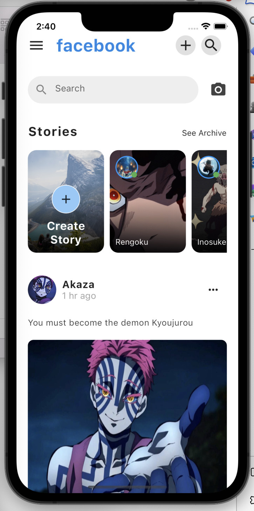
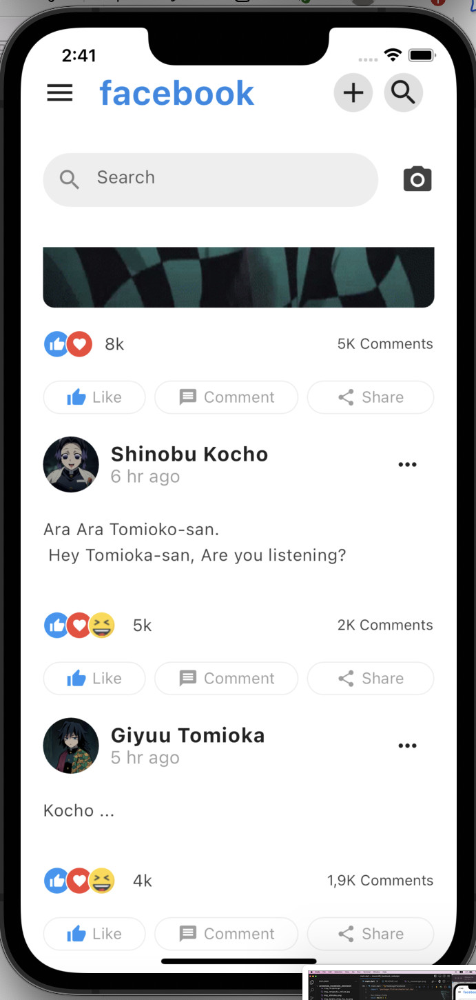

# lesson46_facebook_redesign
Redesign Facebook Application GUI with Flutter

### Screenshot
[](assets/screenshot/img_facebook_1.jpg)
[](assets/screenshot/img_facebook_2.jpg)

### Note Source Code
- Make Icon in a Circle
```
return Container(
      margin: const EdgeInsets.only(
        right: 10,
      ),
      width: 35,
      height: 35,
      // create A Container has shape Circle contains Icon
      decoration: BoxDecoration(
        shape: BoxShape.circle, // must have this line to create a 'Circle'
        color: Colors.grey.shade300,
      ),
      child: Icon(
        icon,   // parameter add another Icons 
        weight: 2,
        size: 30,
      ),
    );
```
