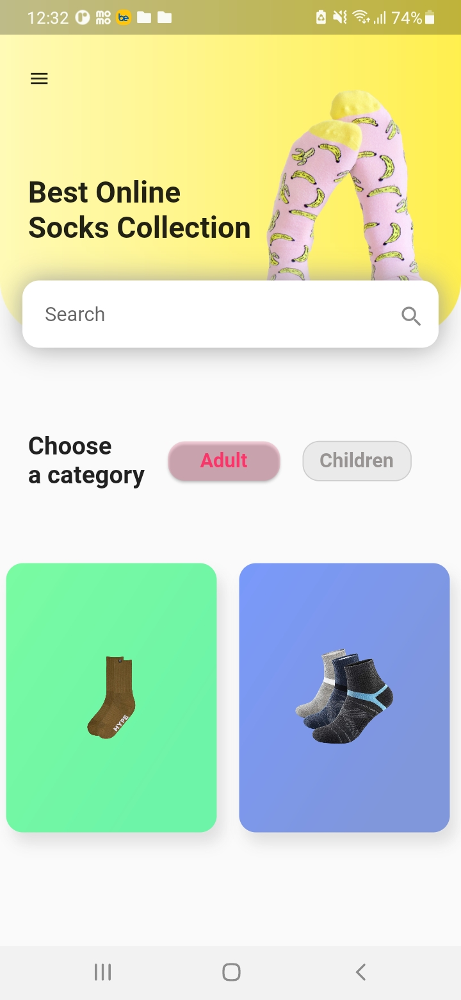

# lesson47_socks_shop
Desgin Socks Shop Application GUI

### Screenshot
[](assets/screenshot/img_overview_1.jpg)
[](assets/screenshot/img_overview_2.jpg)
[](assets/screenshot/img_view_socks_details.jpg)

### Note Source Code
- Flex: flex is used to divide the free space between two child widgets. The flex property is used in a Row or Column widget to determine the proportion of space between the child widgets.

```
    Row(
        crossAxisAlignment: CrossAxisAlignment.center,
        mainAxisAlignment: MainAxisAlignment.spaceBetween,
        children: [
            //free space divided in 4:3 ratio between two child widgets
            Expanded(
            // flex 4: In this container, it occupies 4
            flex: 4,
            child: Text(
                'Best Online\nSocks Collection',
                style: TextStyle(
                fontSize: 24,
                fontWeight: FontWeight.bold,
                ),
            ),
            ),
            Expanded(
            // occupies 3
            flex: 3,
            child:
                Image.asset('assets/images/img_header-socks.png'),
            ),
        ],
    ),
```
    - flex: 4 is used for the first child widget (a piece of text) and flex: 3 for the second child widget (an image)

- Move to another Activity
    - I use GestureDetector and pass in the parameter 'context' and animation PageTransition 
    ```
    onTap: () {
        Navigator.push(
          context,
          PageTransition(
            type: PageTransitionType.fade,
            child: ViewSocks(),
          ),
        );
      },

    ```
    - When user click into Card Item. It will move user to View Detail Socks
    ```
     _makeSocksCard(
        context: context,
        startColor: const Color.fromRGBO(203, 251, 255, 1),
        endColor: const Color.fromRGBO(81, 223, 234, 1),
        image: 'img_socks_1.webp',
        ),
    ```