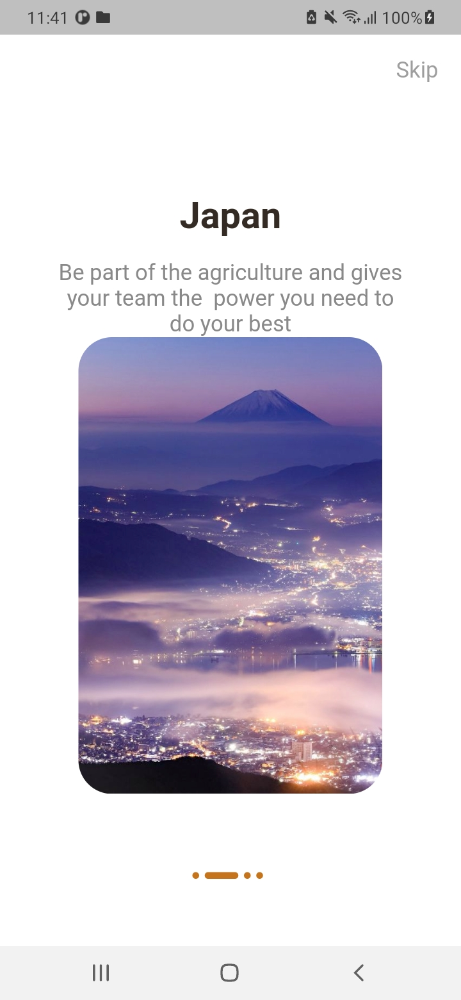

# lesson48_indicators
Desgin Application Introduction Application GUI

### Screenshot
[](assets/screenshot/img_indicators_1.jpg)
[](assets/screenshot/img_indicators_2.jpg)
[](assets/screenshot/img_indicators_reverse.jpg)


### Note Source Code
- This source code is used in PageView. It is used to update new status of Page
- When switching to new state update the currentIndex
```
 onPageChanged: (int page) {
    setState(() {
    // when switching to new state
    // --> update the currentIndex
    currentIndex = page;
    });
},
```
- Show indicators and check which ones are active
```
List<Widget> _buildIndicators() {
    List<Widget> indicators = [];
    for (int i = 0; i < 4; i++) {
      // add indicators
      if (currentIndex == i) {
        // active the indicator
        indicators.add(_indicator(true));
      } else {
        indicators.add(_indicator(false));
      }
    }
    return indicators;
  }
```

- Create GUI for Indicators
```
  Widget _indicator(bool isActive) {
    return AnimatedContainer(
      // duration for animation
      duration: Duration(microseconds: 300),
      height: 6,
      // when animation is triggered. It has a width of 30
      width: isActive ? 30 : 6,
      margin: const EdgeInsets.only(right: 5),
      decoration: BoxDecoration(
        color: ColorSystem.secoundry,
        borderRadius: BorderRadius.circular(5),
      ),
    );
  }
```
- In _makePageIndicators function. I put into para 'reverse = false'
    - Check if reverse is true => display image above information, and make border for image about 10
        ```
        !reverse
            ? Column(
                children: [
                Padding(
                    padding: const EdgeInsets.symmetric(horizontal: 20),
                    // make border radius for image
                    child: ClipRRect(
                    // RR stand for: Rounded-Rectangular
                    borderRadius: BorderRadius.circular(10),
                    child: Image.asset(
                        // 'assets/images/img_scenery_1.jpeg',
                        'assets/images/$image',
                        fit: BoxFit.cover,
                        width: 400,
                        height: 400,
                    ),
                    ),
                ),
                SizedBox(height: 30),
                ],
            )

            /// thay thế bằng size Box, ẩn đi hình ảnh này
            : SizedBox(),
        ```
    - If reverse is false => Display information above image, and make border for image about 30

        ```
        // if reverse == false
            reverse // reverse == false thì hiển thị hình ảnh này  có border Radius 30
                ? Column(
                    children: [
                        Padding(
                        padding: const EdgeInsets.symmetric(horizontal: 20),
                        // child: Image.asset('assets/images/$image'),
                        child: ClipRRect(
                            borderRadius: BorderRadius.circular(30),
                            child: Image.asset('assets/images/$image'),
                        ),
                        ),
                    ],
                    )
                : SizedBox(),   // replace by SizedBox if reverse is true
        ```

