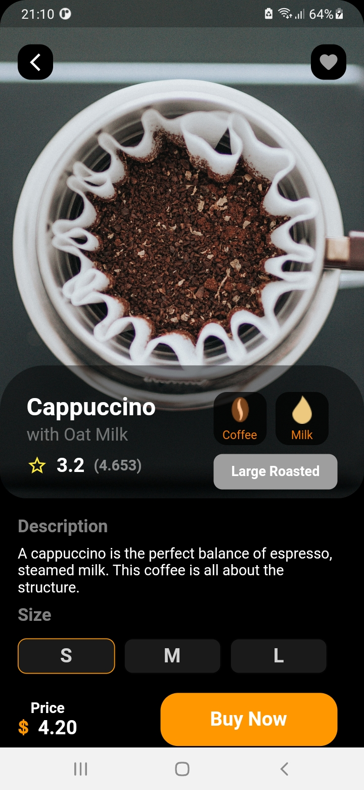
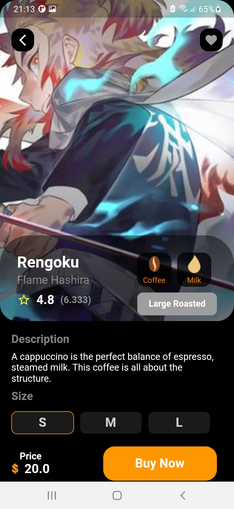

# lesson50_coffee_shop_gui
Desgin Coffee Shop GUI

### Screenshot
[](assets/screenshot/img_list_coffe1.jpg)
[](assets/screenshot/img_recommend_coffe.jpg)
[](assets/screenshot/img_coffe_detials_cappuccino.jpg)
[](assets/screenshot/img_coffee_details.jpg)
[](assets/screenshot/img_coffee_detail_rengoku.jpg)

### Note Source Code  
- Make a notification for the icon in the position of the top right
```
 Stack(
    children: [
      Icon(
        Icons.notifications,
        color: index == 3
            ? Colors.orange
            : Colors.grey.shade600.withOpacity(0.6),
      ),
      Positioned(
        top: 0,
        right: 0,
        child: Container(
          padding: EdgeInsets.all(1),
          decoration: BoxDecoration(
            color: Colors.red,
            borderRadius: BorderRadius.circular(6),
          ),
          constraints: BoxConstraints(
            minWidth: 12,
            minHeight: 12,
          ),
          child: Text(
            '1',
            style: TextStyle(
              color: Colors.white,
              fontSize: 8,
            ),
            textAlign: TextAlign.center,
          ),
        ),
      ),
    ],
  ),
```
- Create a Drawer like Home Button
    - Instead of using Icon then I create many dots and call it back
        - Firstly, Create a circle. In this source code beloư, I define it and call in somewhere 
        ```
        Icon _makeCircle() {
            return Icon(
                Icons.circle,
                color: Colors.grey.shade600,
                size: 10,
            );
        } 
        ```
        - Secondly, Create Navigation bar contains dots following horizontal direction

      ```
       Widget _makeNav() {
            return Row(
                mainAxisAlignment: MainAxisAlignment.spaceBetween,
                children: [
                    _makeCircle(),
                    _makeCircle(),
                ],
            );
        }
       ```
        - Finally, Create container to call back _makeNav functiom 
        ```
        Container(
            width: 40,
            height: 40,
            padding: EdgeInsets.symmetric(
              horizontal: 10,
              vertical: 10,
            ),
            decoration: BoxDecoration(
              color: Colors.white.withOpacity(.6),
              borderRadius: BorderRadius.circular(10),
            ),
            child: Column(
              children: [
                _makeNav(),
                _makeNav(),
              ],
            ),
        ),
        ```
- Make notification/ message for an icon. Put it into a Stack and use Postioned to set top and right
```
    Stack(
        children: [
        Icon(
            Icons.notifications,
            color: index == 3
                ? Colors.orange
                : Colors.grey.shade600.withOpacity(0.6),
        ),
        // set position for Container contains message above icon
        Positioned(
            top: 0,
            right: 2,
            child: Container(
            padding: EdgeInsets.all(2),
            decoration: BoxDecoration(
                color: Colors.red,
                borderRadius: BorderRadius.circular(6),
            ),
            // child: Text(
            //   '1',
            //   style: TextStyle(
            //     color: Colors.white,
            //     fontSize: 8,
            //   ),
            //   textAlign: TextAlign.center,
            // ),
            // creat a dot above icon
            child: Container(
                width: 4,
                height: 4,
                decoration: BoxDecoration(
                    borderRadius: BorderRadius.circular(50),
                    color: Colors.red,
                ),
            ),
            ),
        ),
        ],
    ),
```

