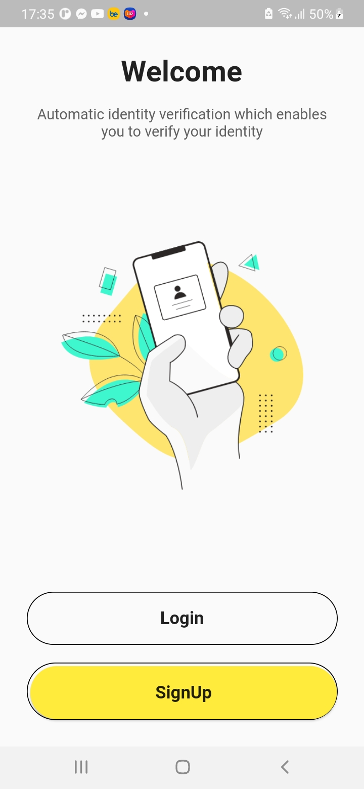
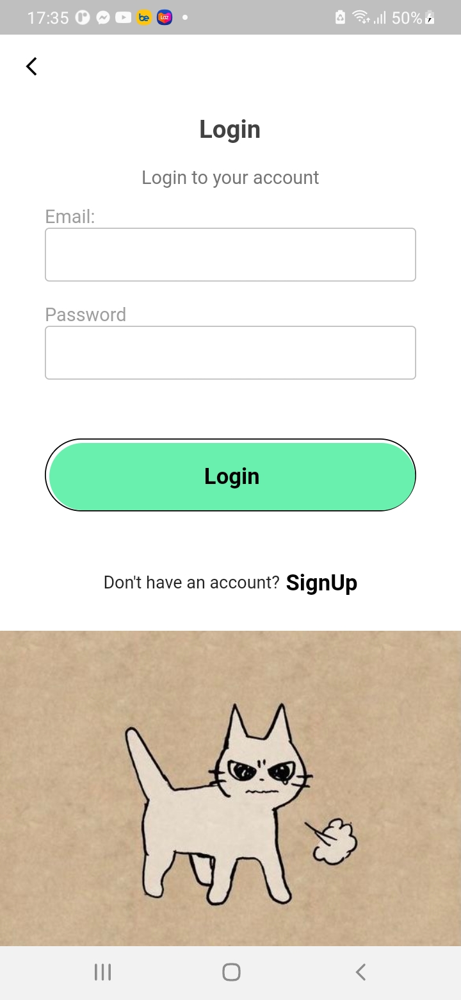
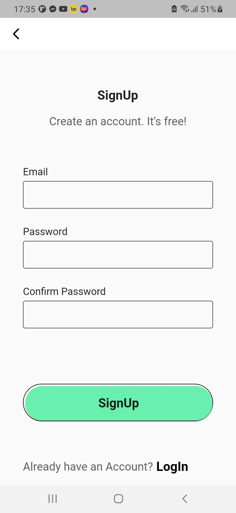

# lesson51_login_signup
Create Login Page, SignUp Account GUI

### Screenshot
[](assets/screenshot/img_home_page.jpg)
[](assets/screenshot/img_login_page.jpg)
[](assets/screenshot/img_register_account.jpg)

### Note Source Code
- Add package Animations into Dependencies:
    ```
    simple_animations: ^3.0.0

    ```
- Move to another Activity. At here I want to move from HomePage from LoginPage 
```
    Navigator.push(
        context,
        MaterialPageRoute(
            builder: (context) => const LoginPage(),
        ),
    );
```
- Return the previous page
    ```
    Navigator.pop(context);
    ```
