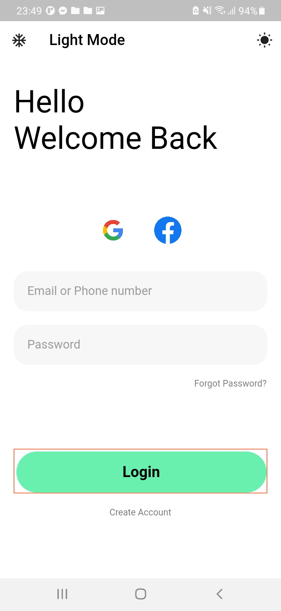
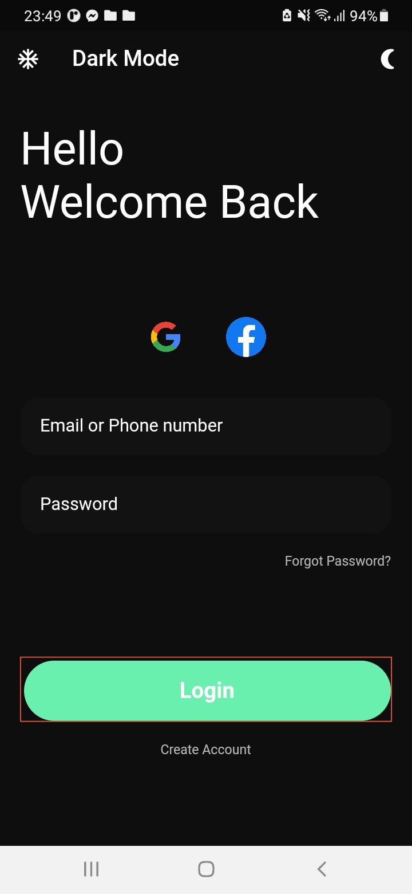

# lesson52_dark_theme
Create Dark/Light Theme for Login Page GUI

### Screenshot
[](assets/screenshot/img_light_theme.jpg)
[](assets/screenshot/img_dark_theme.jpg)

### Note Source Code
- Need add some library to use ChangeNotifier and ThemeModel
```
    provider: ^5.0.0
    shared_preferences: ^2.1.2
```
- Make the color skewed in Button
```
    Container(
        padding: const EdgeInsets.only(top: 3, left: 3),
        decoration: BoxDecoration(
            // make color for each Egde of button
            
            //make this to see the frame of the container after padding 
            // and see the color skewed in the button
            // we can hide this edge by remove the comment below
            border: Border(
            // BorderSide of this Container
            bottom: BorderSide(
                // color: Theme.of(context).primaryColorLight,
                color: Colors.deepOrange,
            ),
            top: BorderSide(
                // color: Theme.of(context).primaryColorLight,
                color: Colors.deepOrange,
            ),
            right: BorderSide(
                // color: Theme.of(context).primaryColorLight,
                color: Colors.deepOrange,
            ),
            left: BorderSide(
                color: Colors.deepOrange,
                // color: Theme.of(context).primaryColorLight,
            ),
            ),
        ),
        // make button
        child: MaterialButton(
            height: 60,
            minWidth: double.infinity,
            onPressed: () {},
            color: Colors.greenAccent,
            elevation: 0,
            // make border radius in MaterialButton
            shape: RoundedRectangleBorder(
            borderRadius: BorderRadius.circular(50),
            ),
            child: Text(
            'Login',
            style: TextStyle(
                fontWeight: FontWeight.bold,
                fontSize: 20,
                color: themeNotifier.isDark
                    ? Colors.white
                    : Colors.black,
            ),
            ),
        ),
        ),
```