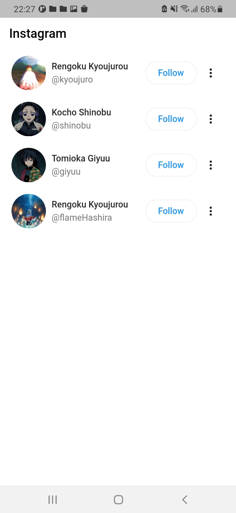
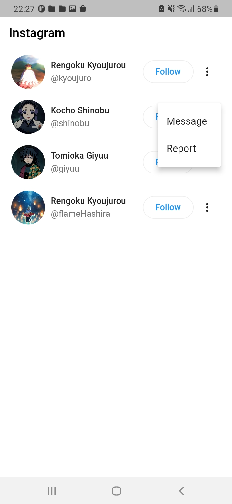
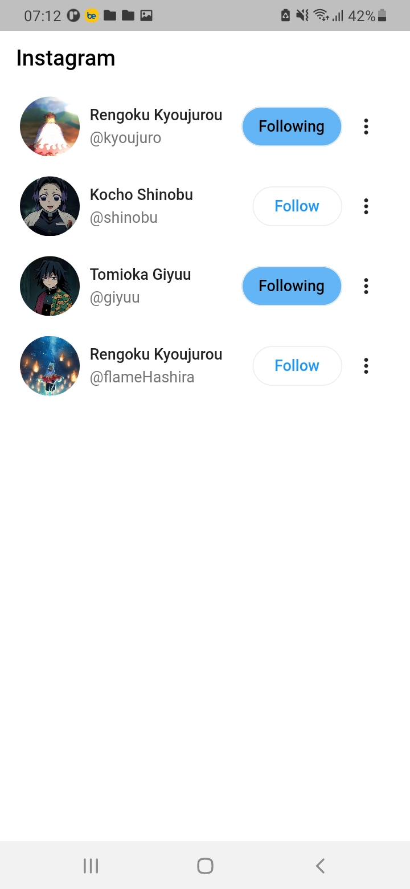
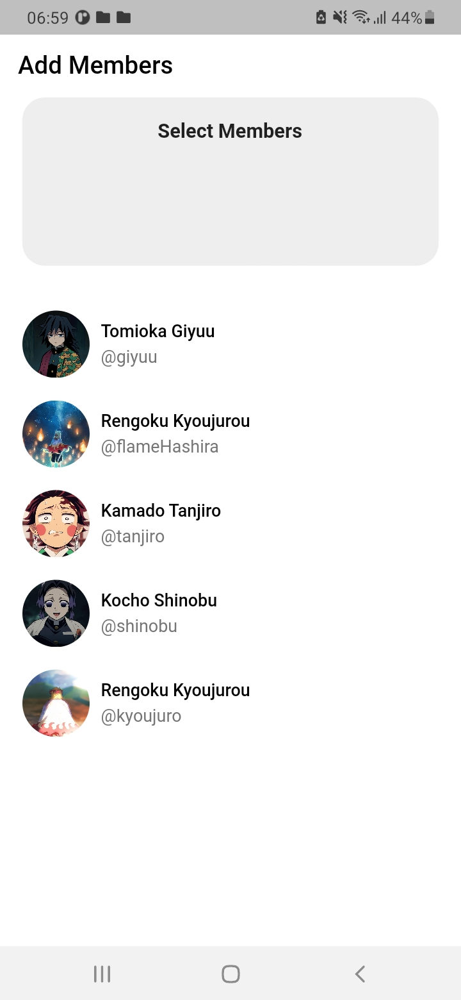
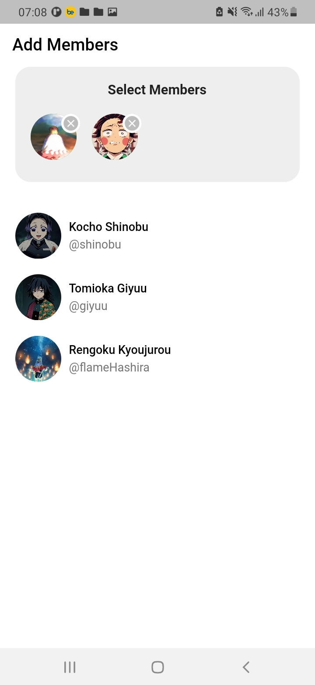
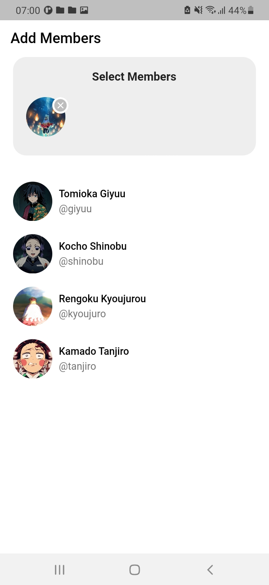

# lesson53_redesign_instagram
Create Following Members in Instagram


## Screenshot

### Following Page 
[](assets/screenshot/img_insta_1.jpg)
[](assets/screenshot/img_insta_2.jpg)
[](assets/screenshot/img_insta_3.jpg)

### Members Page
[](assets/screenshot/img_member_1.jpg)
[](assets/screenshot/img_member_2.jpg)
[](assets/screenshot/img_member_3.jpg)

### Note Source Code
- Make Pop Menu when Click on the icon more information
```
    PopupMenuButton(
        icon: const Icon(Icons.more_vert_rounded),
        itemBuilder: (context) => [
            const PopupMenuItem(
            value: 1,
            child: Text('Message'),
            ),
            const PopupMenuItem(
            value: 2,
            child: Text('Report'),
            ),
            // Add more PopupMenuItem as needed
        ],
        onSelected: (value) {
            // Handle the selected option based on its value
            switch (value) {
            case 1:
                // Do something for Option Message
                break;
            case 2:
                // Do something for Option Report
                break;
            // Handle more cases as needed
            }
        },
        ),
```

