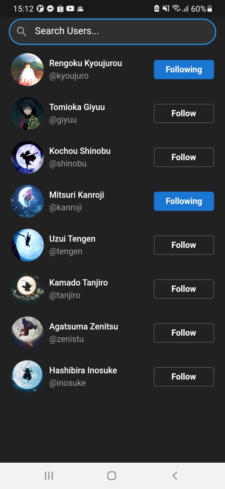
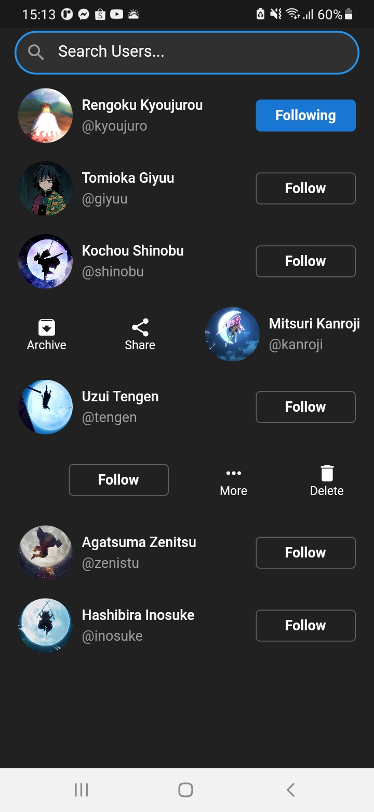
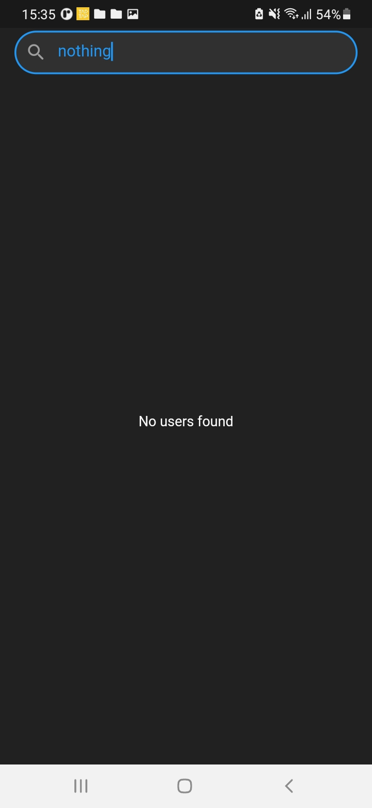

# lesson54_searchable
Create a searchable feature of Instagram

### Screenshot
[](assets/screenshot/img_insta_search_1.jpg)
[](assets/screenshot/img_insta_search_2.jpg)
[](assets/screenshot/img_insta_search_3.jpg)
[](assets/screenshot/img_insta_search_4.jpg)


### Note Source Code
- Search feature: define a user search function by their Name
```
onSearch(String searchValue) {
    // // put user is search into foundUsers List
    // _usersList.foundUsers = _usersList.userList
    //     .where((user) => user.name.toLowerCase().contains(searchValue))
    //     .toList();
    if (searchValue.isEmpty) {
      // if the search value is Empty -> reset the foundUsers List to the
      // original User List
      setState(() {
        _usersList.foundUsers = _usersList.userList;
      });
    }
    // Not Empty -> Filter the userList to find out matching users
    else {
      setState(() {
        _usersList.foundUsers = _usersList.userList
            .where((userIsFound) =>
                userIsFound.name.toLowerCase().contains(searchValue))
            .toList();
      });
    }
  }
```
- Slidable: scroll Widget follows the horizontal axis (left and right) and can do actions on its. And here I used it to display list of Users 
    -  Set how it big by actionExtentRatio
    ```
        actionExtentRatio: 0.25,
    ```
    - Set the action Pane
    ```
      actionPane: const SlidableDrawerActionPane(),
    ```
    - Scroll from left to right axis standard by actions
    ```
        actions: <Widget>[
            // a list of Actions
            IconSlideAction(
                caption: 'Archive',
                color: Colors.transparent,
                icon: Icons.archive,
                onTap: () {
                print('Archive');
                },
            ),
            // more actions
           //...
        ],
    ```
    - Scroll from right to left axis standard by secondaryActions
    ```
        secondaryActions: [
            IconSlideAction(
                caption: 'More',
                color: Colors.transparent,
                icon: Icons.more_horiz,
                onTap: () {
                    print('More');
                },
            ),
            // another actions ...
        ],
    ```

