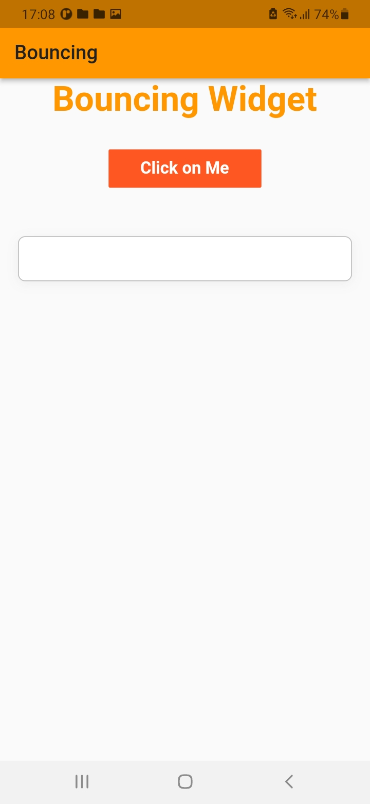

# lesson57_sample_gui
Some Flutter examples
### Bouncing 
- A widget that enables you make bouncing animation on your buttons after you click on it. <br>
[](assets/screenshot/img_bouncing_click.jpg)
[](assets/screenshot/img_bouncing_waiting_animation.jpg) <br>

- Scale factor
    -  < 0 => the bouncing will be reversed and widget will grow
    -  = 1 => default value
    -  > 1 => increase the bouncing effect
- Add to dependencies: 
```
    bouncing_widget: ^2.0.0
```
- Example
```
    BouncingWidget(
        child: Text(
            'Bouncing Widget',
            style: TextStyle(
                color: Colors.orange,
                fontWeight: FontWeight.bold,
                fontSize: 35,
            ),
        ),
        onPressed: () {},
        scaleFactor: 1.5,
        duration: Duration(milliseconds: 100),
    ),
```
### Box
[](assets/screenshot/img_rotate_go.jpg)
[](assets/screenshot/img_rotating.jpg)
- Use RotationTransition Widget and we must define turns. I made a square with width and height. Inside the square, we have a container containing the image. When we press on button Go then the square rotates with a start and begin is defined
- Like the sample code below:
```
RotationTransition(
    turns: Tween(begin: -6.0, end: 4.0).animate(_controller),
    child: AnimatedContainer(
    duration: Duration(
        milliseconds: 4000,
    ),
    width: 200,
    height: 200,
    color: Colors.orangeAccent,
    // don't need some lines code below!
    child: Container(
        decoration: BoxDecoration(
        shape: BoxShape.circle,
        image: DecorationImage(
            image: AssetImage(
            'assets/images/img_rengoku_back.jpeg',
            ),
            fit: BoxFit.cover,
        ),
        ),
    ),
    ),
),
```
- Here we have turns like that means rotating the square x10 times during the time is defined
```
turns: Tween(begin: -6.0, end: 4.0).animate(_controller),
```
- Move to another Page
```
    Navigator.push(
        context,
        MaterialPageRoute(
        builder: (context) =>
            const DesignButtonNavigationBar(),
        ),
    );
```
- Make Border Button
```
    Container(
        padding: EdgeInsets.only(top: 3, left: 3),
        decoration: BoxDecoration(
            borderRadius: BorderRadius.circular(50),
            // color: Colors.greenAccent,
            border: Border.all(
                color: Colors.black,
            ),
        ),
        child: MaterialButton(
        onPressed: () {
            _controller.reset();
        },
        color: Colors.greenAccent,
        shape: RoundedRectangleBorder(
            borderRadius: BorderRadius.circular(50),
        ),
        height: 60,
        minWidth: MediaQuery.of(context).size.height * 0.2,
        child: Text(
                'Stop',
                style: TextStyle(
                fontWeight: FontWeight.bold,
                fontSize: 18,
                ),
            ),
        ),
    ),
```

### Searchable && Dropdown Menu
[](assets/screenshot/img_search_findV.jpg)
[](assets/screenshot/img_search_getV.jpg)

### Bottom Navigation Bar
[](assets/screenshot/img_navigation_home.jpg)
[](assets/screenshot/img_navigation_search.jpg)
[](assets/screenshot/img_navigation_user.jpg)
[](assets/screenshot/img_navigation_notification.jpg)
[](assets/screenshot/img_navigation_addItems.jpg)

- When create bottom navigation bar like above. There are a few important notes
    - Must use location for this button. If we don't use it will locate at the bottom right of the screen
    - Must contain 'Docked' in the location phrase.
```
// this icon will be in the middle and above the bottom Navigation
floatingActionButtonLocation: FloatingActionButtonLocation.centerDocked,
```
- In BottomAppBar of BottomNavigationBar we have 2 shapes to define: AutomaticNotchedShape() or CircularNotchedRectangle(),
```
    bottomNavigationBar: BottomAppBar(
        // background color for this bottom Nav
        color: Colors.grey.shade900,
        // make shape below icon stay centerDocked
        // if want to make this shape -->  one Icon MUST locate in the Dock
        // shape: CircularNotchedRectangle(),
        shape: const AutomaticNotchedShape(
          // host -> must no be null
          // make borderRadius for the whole bottom Navigation Bar through BorderRaidus.all

          RoundedRectangleBorder(
            borderRadius: BorderRadius.all(
              Radius.circular(50),
            ),
          ),

          /// -------- Host always flying above/ front of guest ------------
          // guest  -> may be not null
          // make border Radius for the space below Icon in centerDocked
          RoundedRectangleBorder(
            borderRadius: BorderRadius.vertical(
              top: Radius.circular(22),
            ),
          ),
        ),

        // in bottom We create a container contains Icons
        child: Container(
          height: 100,
          padding: EdgeInsets.symmetric(horizontal: 20),
          child: Row(
            mainAxisAlignment: MainAxisAlignment.spaceBetween,
            children: [
              IconButton(
                icon: Icon(
                  Icons.home,
                  color: currentPage == 0 ? Colors.white : Colors.grey,
                  size: 30,
                ),
                onPressed: () {
                  setPage(0); // Open the current Index of page is defined
                },
              ),
              // more icons
            ],
          ),
        ),
      ),

```
- When we use shape: CircularNotchedRectangle(), <br>
[](assets/screenshot/img_navigation_bottom_bar_default.jpg) <br>
- When we use shape: AutomaticNotchedShape(). We must design something in this function <br>
[](assets/screenshot/img_navigation_bottom_bar_design.jpg) <br>
    - Notes: At this function has 2 para: host and guest
        - Host: must not be null
        - Guest: may be no not null 
        - Host always above/ front of guest
```
    shape: const AutomaticNotchedShape(
        // host -> must no be null
        // make borderRadius for the whole bottom Navigation Bar through BorderRaidus.all

        RoundedRectangleBorder(
            borderRadius: BorderRadius.all(
                Radius.circular(50),
            ),
        ),
        /// -------- Host always flying above/ front of guest ------------
        // guest  -> may be not null
        // make border Radius for the space below Icon in centerDocked
        RoundedRectangleBorder(
            borderRadius: BorderRadius.vertical(
                top: Radius.circular(22),
            ),
        ),
    ),
```

### Bottom Navy
[](assets/screenshot/img_navy_home.jpg)
[](assets/screenshot/img_navy_message.jpg)
[](assets/screenshot/img_navy_settings.jpg)
[](assets/screenshot/img_navy_user.jpg)

### Animated Button
- Add to dependencies:
```
animated_button: ^0.2.0
```
[](assets/screenshot/img_animated_button.jpg)

### Sample Button
- Elevated and Outlined Button <br>
[](assets/screenshot/img_elevated_outlined_button.jpg)
- Elevated Button with Icon <br>
[](assets/screenshot/img_elevated_button.jpg)
- Circle Button with notifications <br>
[](assets/screenshot/img_circle_button.jpg)
- Circle Button with notifications is defined 
[](assets/screenshot/img_button_with_notifi.jpg)
