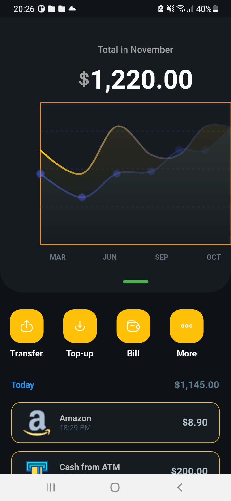
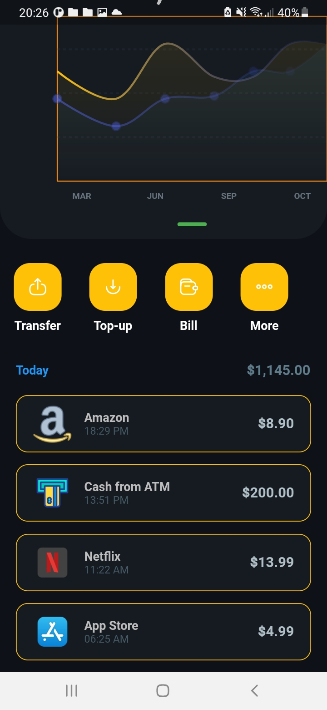
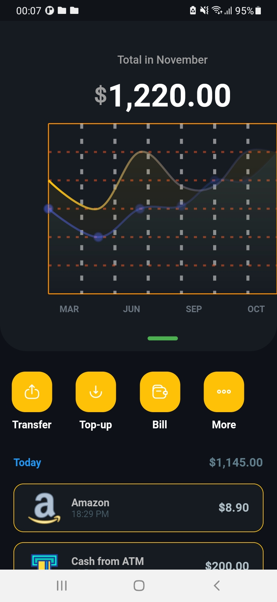

# lesson59_expenses_app
Create Expenses Applications with Line Chart

### Screenshot
[](assets/screenshot/img_expense_line_chart.jpg)
[](assets/screenshot/img_expense_investment_today.jpg)
[](assets/screenshot/img_expense_square_dots.jpg)

### Note Source Code
- Add library to dependencies:
```
  iconsax: ^0.0.8
  fl_chart: ^0.40.2
  animate_do: ^3.0.2
```


