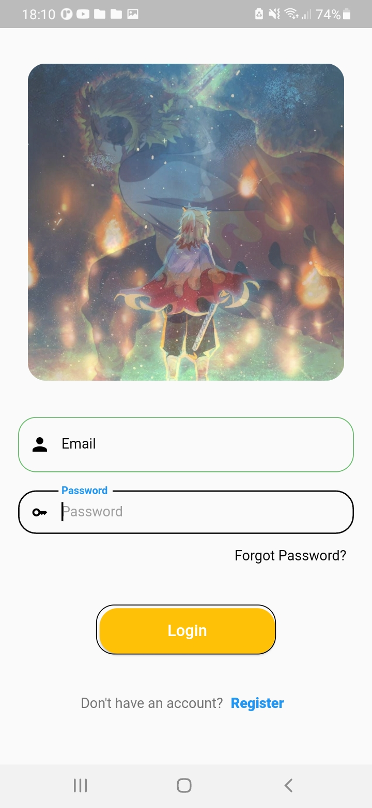
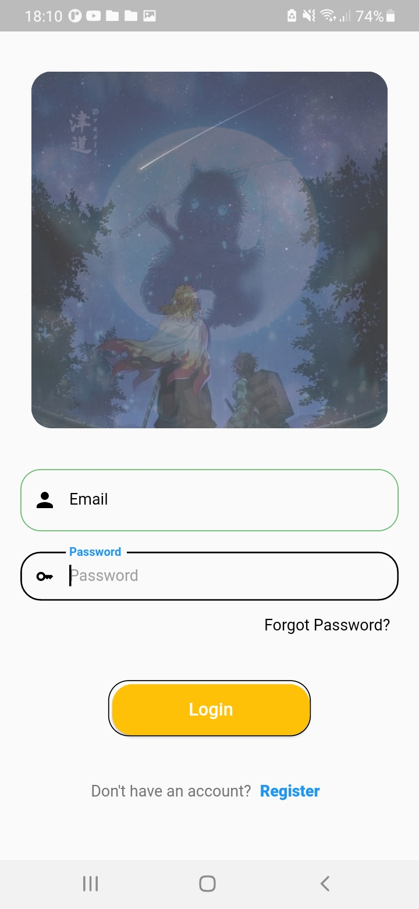
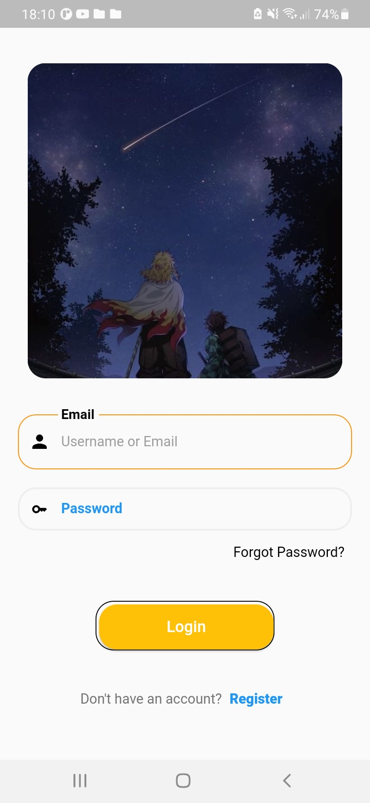

# lesson61_register_with_phone
Create Input Phone Number

### Screenshot
[](assets/screenshot/img_choose_country.jpg)
[](assets/screenshot/img_enter_phone.jpg)
[](assets/screenshot/img_loading.jpg)

### Note Source Code
- Add some library 
```
  intl_phone_number_input: ^0.7.0+2 # phone number
  animate_do: ^3.0.2
  flutter_verification_code: ^1.1.0 # otp verify
  pin_code_fields: ^7.3.0   # otp verify
  fluttertoast: ^8.2.2
  iconsax: ^0.0.8   
```
- Define routes: I used to navigate from the current screen to the '/login' screen
```
    onTap: () {
        // move to login page
        // need define '/login' routes
        Navigator.of(context).pushReplacementNamed('/login');
    },

```
    - So I define in MaterialApp with this routes below:     
    ```
        routes: {
            '/login': (context) => LoginPage(),
            // Other routes...
        },
    ```

- Source code make phone number 
  ```
    InternationalPhoneNumberInput(
        onInputChanged: (PhoneNumber number) {
          print(number.phoneNumber);
        },
        onInputValidated: (bool value) {
          print(value);
        },
        // Configure to show the country list at the bottom of the widget
        selectorConfig: const SelectorConfig(
          selectorType: PhoneInputSelectorType.BOTTOM_SHEET,
        ),
        // A flag to determine whether nulls should be ignored during validation
        ignoreBlank: false,
        ///// Used to configure the auto validation of [FormField] and [Form] widgets.
        // No auto validation will occur.
        autoValidateMode: AutovalidateMode.disabled,
        // Set Style Phone Code of a Country
        // for example: VietNam phone code: +84
        selectorTextStyle: const TextStyle(
          color: Colors.black,
        ),
        textFieldController: controller,
        formatInput: false,
        // length for phone number
        maxLength: 10,
        // Requests a numeric keyboard with additional settings.
        keyboardType: const TextInputType.numberWithOptions(
          signed: true,
          decimal: true,
        ),
        cursorColor: Colors.green,
        // remove the underline default of InternationalPhoneNumberInput
        inputDecoration: InputDecoration(
          contentPadding:
              const EdgeInsets.only(bottom: 15, left: 0),
          border: InputBorder.none,
          // make hint text
          hintText: 'Phone Number',
          hintStyle: TextStyle(
            color: Colors.grey.shade600,
            fontSize: 16,
          ),
        ),
        onSaved: (PhoneNumber number) {
          print('On Saved: $number');
        },
    ),
  ```


### Login Screen
[](assets/screenshot/img_login_side_1.jpg)
[](assets/screenshot/img_login_side_2.jpg)
[](assets/screenshot/img_login_side_3.jpg)
- Display another image during 5. With the code below
```
 int activeIndex = 0;

  @override
  void initState() {
    //Timer.periodic is a class used to create a periodic timer.
    // It allows you to perform an action
    //after a certain amount of time and repeat it periodically.
    Timer.periodic(Duration(seconds: 5), (timer) {
      // after 5 seconds increase 1
      setState(() {
        activeIndex++;
        // count up to 4 => reset
        if (activeIndex == 4) activeIndex = 0;
      });
    });

    super.initState();
  }   
```
 - If the activeIndex matches the index of the image, its opacity is set to 1 (visible), otherwise the opacity is set to 0 (hidden).
 ```
    Positioned(
      // make image in center of Container with height: 350
      top: 0,
      left: 0,
      right: 0,
      bottom: 0,
      child: AnimatedOpacity(
        //If the activeIndex matches the index of the image,
        //its opacity is set to 1 (visible), otherwise,
        // the opacity is set to 0 (hidden).
        opacity: activeIndex == 0 ? 1 : 0,
        // the duration of the opacity animation,
        duration: Duration(seconds: 4),
        curve: Curves.linear,
        // make borderRaius for this image
        // child: ClipRRect(
        //   borderRadius: BorderRadius.circular(20),
        child: Image.asset(
          'assets/images/img_rengoku_ruc_chay.jpeg',
          fit: BoxFit.cover,
        ),
      ),
      // ),
    ),
 ```

 - Make button
 ```
    Container(
      padding: const EdgeInsets.only(
        top: 3,
        left: 3,
      ),
      decoration: BoxDecoration(
        borderRadius: BorderRadius.circular(20),
        // color: Colors.amber,
        border: Border.all(
          color: Colors.black,
        ),
      ),
      child: MaterialButton(
        onPressed: () {},
        height: 50,
        color: Colors.amber,
        child: Text(
          "Login",
          style: const TextStyle(
            color: Colors.white,
            fontSize: 16.0,
          ),
        ),
        padding: const EdgeInsets.symmetric(horizontal: 75),
        shape: RoundedRectangleBorder(
          borderRadius: BorderRadius.circular(20.0),
        ),
      ),
    ),
 ```