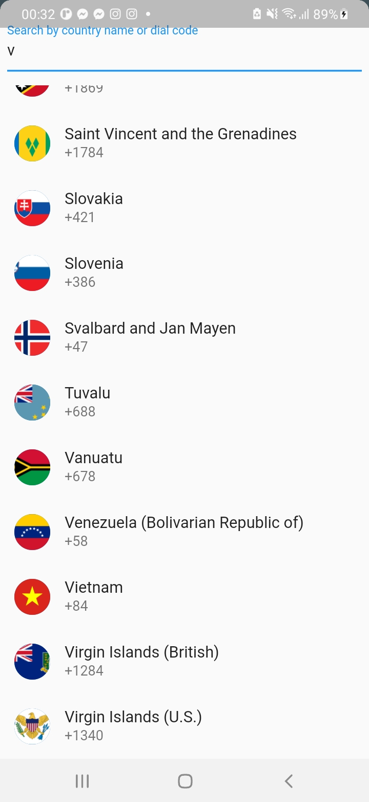
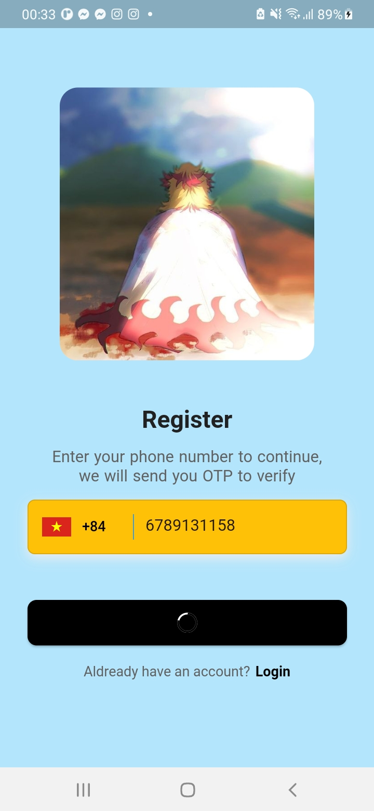

# lesson61_register_with_phone
Create Input Phone Number

### Screenshot
[](assets/screenshot/img_choose_country.jpg)
[](assets/screenshot/img_enter_phone.jpg)
[](assets/screenshot/img_loading.jpg)

### Note Source Code
- Add some library 
```
  intl_phone_number_input: ^0.7.0+2 # phone number
  animate_do: ^3.0.2
  flutter_verification_code: ^1.1.0 # otp verify
  pin_code_fields: ^7.3.0   # otp verify
  fluttertoast: ^8.2.2
  iconsax: ^0.0.8   
```
- Define routes: I used to navigate from the current screen to the '/login' screen
```
    onTap: () {
        // move to login page
        // need define '/login' routes
        Navigator.of(context).pushReplacementNamed('/login');
    },
```
    - So I define in MaterialApp with this routes below: 
    ```
        routes: {
            '/login': (context) => LoginPage(),
            // Other routes...
        },
    ```

- Source code make phone number 
```
                    InternationalPhoneNumberInput(
                        onInputChanged: (PhoneNumber number) {
                          print(number.phoneNumber);
                        },
                        onInputValidated: (bool value) {
                          print(value);
                        },
                        // Configure to show the country list at the bottom of the widget
                        selectorConfig: const SelectorConfig(
                          selectorType: PhoneInputSelectorType.BOTTOM_SHEET,
                        ),
                        // A flag to determine whether nulls should be ignored during validation
                        ignoreBlank: false,
                        ///// Used to configure the auto validation of [FormField] and [Form] widgets.
                        // No auto validation will occur.
                        autoValidateMode: AutovalidateMode.disabled,
                        // Set Style Phone Code of a Country
                        // for example: VietNam phone code: +84
                        selectorTextStyle: const TextStyle(
                          color: Colors.black,
                        ),
                        textFieldController: controller,
                        formatInput: false,
                        // length for phone number
                        maxLength: 10,
                        // Requests a numeric keyboard with additional settings.
                        keyboardType: const TextInputType.numberWithOptions(
                          signed: true,
                          decimal: true,
                        ),
                        cursorColor: Colors.green,
                        // remove the underline default of InternationalPhoneNumberInput
                        inputDecoration: InputDecoration(
                          contentPadding:
                              const EdgeInsets.only(bottom: 15, left: 0),
                          border: InputBorder.none,
                          // make hint text
                          hintText: 'Phone Number',
                          hintStyle: TextStyle(
                            color: Colors.grey.shade600,
                            fontSize: 16,
                          ),
                        ),
                        onSaved: (PhoneNumber number) {
                          print('On Saved: $number');
                        },
                    ),
```
